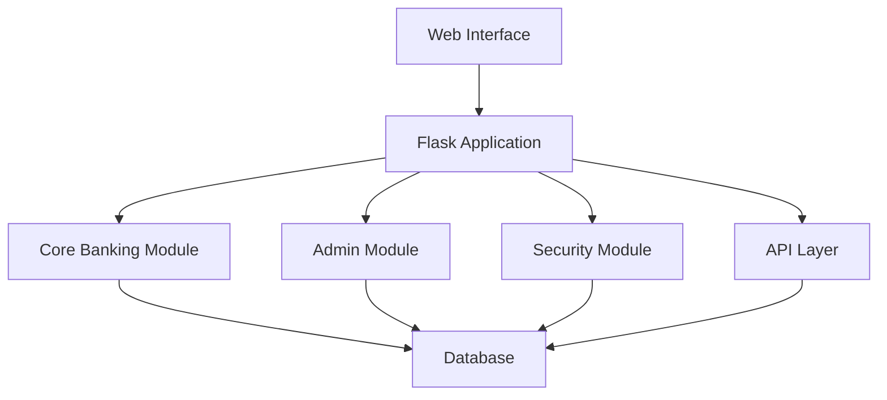

# Flask Banking System

A powerful, modular, and secure banking system built with Flask. This application provides a comprehensive solution for
managing digital currency transactions, user accounts, and administrative controls with an intuitive web interface.

## Features

### Core Banking Features

- **User Account Management**: Create, manage, and secure user accounts with password hashing
- **Wallet System**: Digital currency wallets with real-time balance tracking
- **Transaction Processing**: Secure transfer of funds between users
- **Transaction Logs**: Comprehensive logging of all system activities
- **Refund System**: Request and process refunds with administrative approval
- **Treasury Management**: Mint and burn currency to control the economy

### Administrative Features

- **Admin Dashboard**: Centralized control panel for system management
- **User Management**: Create, modify, and manage user accounts
- **Wallet Administration**: Create special wallets and manage permissions
- **Database Explorer**: Direct database access with protection for admin accounts
- **System Health Monitoring**: Real-time metrics on system performance
- **Rule Management**: Dynamic rule creation and enforcement

### Security Features

- **Password Hashing**: Secure storage of user credentials
- **API Access Control**: Prevents unauthorized API access from external sources
- **Admin Account Protection**: Safeguards against accidental deletion or modification
- **Input Validation**: Protects against injection attacks
- **Audit Logging**: Tracks all system activities for security review

### User Experience

- **Responsive Design**: Works on desktop and mobile devices
- **Dark Mode Support**: Reduces eye strain in low-light environments
- **Real-time Updates**: Automatic page refreshes after actions
- **Leaderboard**: Gamification element showing top account holders
- **Intuitive Navigation**: User-friendly interface for all operations

## System Architecture

The Flask Banking System is built with modularity in mind, making it easy to extend and customize:



### Technical Stack

- **Backend**: Python with Flask framework
- **Database**: Postgresql (easily configurable for other databases - Tested on AIVEN)
- **Frontend**: HTML5, CSS, JavaScript with modern responsive design
- **Security**: Werkzeug security features, custom middleware
- **API**: RESTful API architecture with JSON responses
- **Deployer**: Vercel

## Getting Started

### Prerequisites

- Python (Tested on 3.11)
- pip (Python package manager)
- Git (optional, for cloning the repository)

### Installation

> [!WARNING]
> This only supports 3.11+ versions of Python

#### Installation (Vercel)

This project is ready to deploy on [Vercel](https://vercel.com) with just a few clicks.

1. **Fork this repo (maybe leave a star)**

2. **Go to [vercel.com/import](https://vercel.com/import)**

3. **Import your fork**
    - Click **"Import Git Repository"**
    - Select your GitHub account and this repo that you forked

4. **Use default settings**
    - Vercel will auto-detect everything from `vercel.json`
    - No need to configure anything manually except ENV VARIABLES:
        - `SECRET_KEY`: Flask Secret Key - Make this strong
        - `DATABASE_URL`: Postgresql access URL - I recommend AIVEN

5. **Deploy!**
    - Wait for the build to finish
    - Your app will be live at a Vercel URL like `https://your-app.vercel.app`

---

> 📦 This repo includes:
> - A `vercel.json` config
> - Flask backend in `api/index.py`
> - Dependencies in `requirements.txt`

> [!NOTE]
> Optional, you can go to the file `banking/global_vars.py` and modify the `ALLOW_PUBLIC_API_ACCESS` value,
> though it's HIGHLY discouraged to do so, as it will allow anyone to access the API's without strong authentication.

#### Installation (Locally)

1. **Clone the repository**
   ```bash
   git clone https://github.com/yourusername/flask-banking-system.git
   cd flask-banking-system
   ```
2. **Install dependencies**
   ```bash
   pip install -r requirements.txt
   ```
3. **Set up the ENV variables**
    - `SECRET_KEY`: Flask Secret Key - Make this strong
    - `DATABASE_URL`: Postgresql access URL - I recommend AIVEN

4. **Start the application**
   ```bash
   python app.py
   ```
5. **Access the application**
   Open your browser and navigate to `http://localhost:5000`

> [!NOTE]
> Optional, you can go to the file `banking/global_vars.py` and modify the `ALLOW_PUBLIC_API_ACCESS` value,
> though it's HIGHLY discouraged to do so, as it will allow anyone to access the API's without strong authentication.

#### First-time Setup

1. **Create an admin account**
    - Navigate to `/setup` on first run (or just open the site, if it isn't init it auto redirects here)
    - Create your administrator account and bank name - etc
    - This page will be disabled after initial setup

2. **Configure system rules**
    - Log in as admin (unchangeable)
    - Navigate to Admin > Rules
    - Set up initial system parameters

3. **Create initial currency pool**
    - Navigate to Admin > Treasury
    - Mint initial currency supply

## Usage Examples

### For Users

1. **Creating an account**
    - Navigate to the login page
    - A request wallet button will be there, click on it
    - Fill required fields
    - Your wallet will be automatically created after admin approval

2. **Transferring funds**
    - Log in to your account
    - Navigate to Wallet
    - Enter recipient's username and amount
    - Confirm the transaction

3. **Viewing transaction history**
    - Navigate to Logs
    - View all your past transactions
    - Request refunds if needed

### For Administrators

1. **Managing users**
    - Navigate to Admin > Wallets
    - Create, modify, or deactivate user accounts

2. **System monitoring **(Globally accessible)
    - Navigate to Admin > Server Health
    - View real-time metrics on system performance

3. **Check Database**
    - Navigate to Admin > Database Explorer
    - Execute SQL queries or use predefined queries to check system status

## Security Considerations

- The system implements API access control to prevent unauthorized access from external sources
- Admin accounts are protected from accidental deletion or modification
- All passwords are hashed before storage
- Input validation is performed on all user inputs

## Customization

The Flask Banking System is designed to be highly customizable:

- **Database**: Replace PostgreSQL with MySQL, SQLite, or other databases
- **Authentication**: Integrate with OAuth, LDAP, or other authentication systems
- **UI Themes**: Modify CSS to match your organization's branding
- **Business Rules**: Adjust transaction limits, fees, and other parameters
- **Logging**: Configure detailed logging for auditing and debugging

## Troubleshooting

### Common Issues

1. **Database connection errors**
    - Check database file permissions
    - Ensure PostgreSQL is properly installed

2. **Page not refreshing after actions**
    - Clear browser cache
    - Check JavaScript console for errors

3. **API access denied**
    - Verify you're accessing from the same origin
    - Check admin privileges if required

### Getting Help

- Check the issues section on GitHub
- Contact the maintainers at support@flaskbankingsystem.com

## Contributing

Contributions are welcome! Please feel free to submit a Pull Request.

## License

This project is licensed under the MIT License - see the LICENSE file for details.
